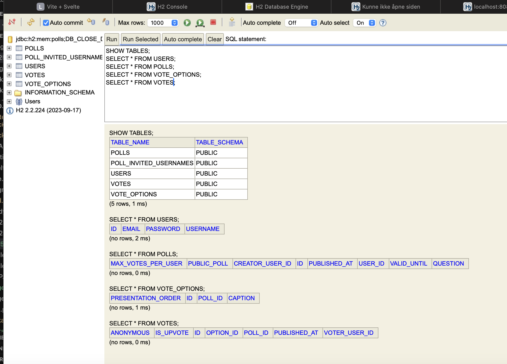

# DAT250 Expass 4 Report

## Technical Problems 

During the installation and use of Java Persistence Architecture (JPA) with Hibernate and H2, I met a few technical issues:

- Why I Removed `import jakarta.persistence.PersistenceConfiguration;`

The import `jakarta.persistence.PersistenceConfiguration;` was removed because it does not exist in the standard JPA API. JPA configuration is handled via the `persistence.xml` file (As shown in klecture) and not through a `PersistenceConfiguration` class. Keeping this import would cause issues. All my needed configurations is placed in `persistence.xml` or as properties in the application configuration files.

- Why I Use `persistence.xml`

The `persistence.xml` file is a standard configuration file required by JPA. This file allows the application to know how to connect to the database and how to manage entities. Without `persistence.xml`, JPA cannot initialize the persistence context or entity manager.

- **Identifier Generation Exception:** From earlier, entities used `UUID` as IDs, which caused `IdentifierGenerationException` because JPA/Hibernate expects auto-generated numeric IDs by default. This was resolved by switching all entity IDs to `Long` and annotating them with `@GeneratedValue(strategy = GenerationType.IDENTITY)`.

- **Lock Timeout Errors:** The H2 in-memory database would sometimes throw lock timeout errors during tests. This was fixed by adding `;LOCK_TIMEOUT=10000` to the JDBC URL in `persistence.xml` for both main and test resources.

- **Type Mismatches:** After converting IDs to `Long`, some service and controller methods still used `UUID`, causing compile errors. All method signatures and usages were updated to use `Long` for consistency.

- **JPA Provider Not Found:** Early on, a missing persistence provider error was resolved by ensuring the correct Hibernate dependencies were included in the Gradle build file.

## Link to Code (Experiment 2)

[GitHub Repository - Dat250.Lab](https://github.com/ThomasTolo/Dat250.Lab)

All tests passed successfully after the fixes.

## Inspecting Database Tables

To inspect the database tables created by JPA/Hibernate, the H2 web console was used:

1. Started the application with the H2 database enabled. 
2. Accessed the H2 console at `http://localhost:8082` .
3. Connected using the JDBC URL from `persistence.xml`.
4. Ran `SHOW TABLES;` and `SELECT * FROM <table>;` to view the structure and contents.

**Tables Created:**
- USERS
- POLLS
- VOTE_OPTIONS
- VOTES

These tables correspond to the JPA entities. Screenshots of the H2 console showing the tables and sample data are included below:

## Pending Issues

 All tests pass, and the application works as expected. No issues remain. (Unless we think about the previous pollscenario test I created in expass 2)

