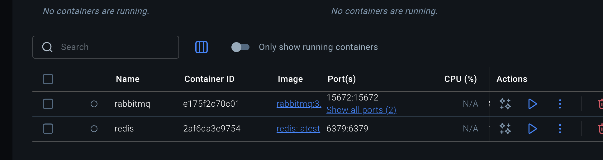

# DAT250 Experimental Assignment 6

## Technical problems encountered
- RabbitMQ connection errors: At first, I kept getting “connection refused” because RabbitMQ wasn’t running. After starting it, I set up the exchange (poll-exchange), routing key (poll.<pollId>), and made sure everything used a single queue.

## Pending
- Security hardening: Still using default RabbitMQ `guest/guest` credentials 

